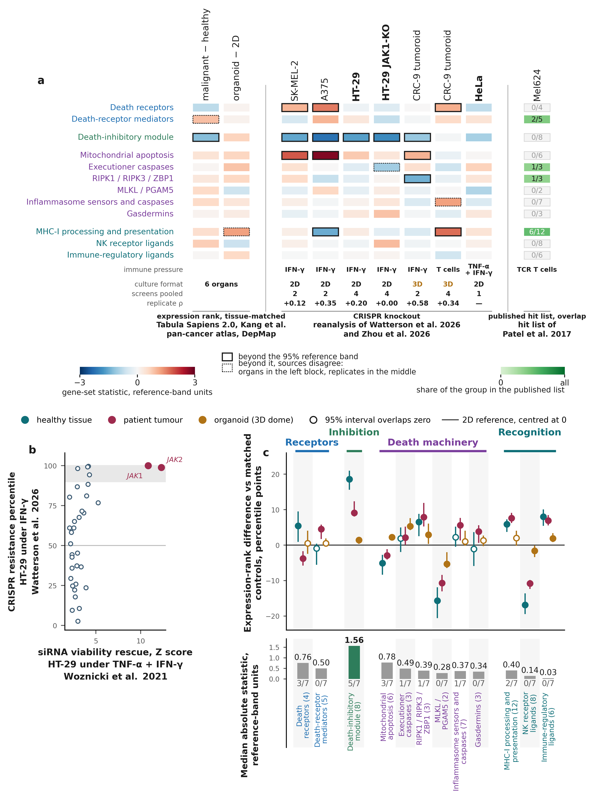

# Cell-death regulation across patient tumors, 3D tumoroids and 2D cell lines

Analysis code, derived tables and Figure 6 for the manuscript *Cell-death programs and responses to immune pressure across epithelial tumor models*.

The expression analysis compares 20 healthy epithelial profiles, 231 malignant epithelial profiles, 152 3D dome models and 401 2D adherent models across six anatomical sites. It examines 67 genes in 12 selected mechanistic groups. Functional comparisons summarize seven CRISPR selection arms, an HT-29 siRNA comparison and overlap with a published TCR-selection candidate list.



## Reproduce Figure 6

Python 3.12 is used for the verified environment.

```bash
python -m venv .venv
source .venv/bin/activate
python -m pip install -r requirements.txt
bash code/run_all.sh
```

The workflow recalculates 72 expression estimates with cluster-bootstrap intervals, 48 expression reference bands and 24 normalized contrasts from deposited per-profile scores. It checks the functional summaries, candidate-list overlaps and MLKL/PGAM5 sensitivity analysis, renders the figure and compares its pixels with the supplied PNG. Outputs are written to `build/`. Input tables are not overwritten. A missing output or failed comparison stops the workflow.

For plotting alone:

```bash
python code/make_full_figure.py tables build/Figure6
```

## Files and data provenance

| Location | Contents |
| --- | --- |
| `code/` | Analysis, plotting and verification scripts |
| `tables/` | Profile scores, expression summaries, screen summaries and provenance |
| `source_data/` | Six numerical source tables used by the figure |
| `figures/` | Accepted Figure 6, PDF, PNG and legend |
| `METHODS.md` | Estimators, resampling, functional comparisons and limitations |
| `GROUP_ANNOTATIONS.tsv` | Group membership interpretation and biological references |
| `SOURCE_DATASETS.tsv` | Primary publications, data locations and exact source components |
| `REFERENCE_METADATA.json` | Bibliographic metadata, including author order |
| `REFERENCES.md` | Formatted source and annotation references |
| `schema/table_aliases.json` | Mapping from deposited table labels to the English code schema |
| `docs/PRIMARY_INPUTS.md` | Input requirements and scope of primary-data utilities |

All 51 numerical and provenance tables are byte-identical to the checked `Figure6_Source_Data_v1.0.0.zip` archive. `ZENODO_TABLE_SNAPSHOT.json` records their SHA-256 checksums. The associated data-record DOI is [10.5281/zenodo.22863363](https://doi.org/10.5281/zenodo.22863363); the record remained unpublished at the time of this repository check. This repository does not assign that data DOI to its software.

The historical `IKM_` filename prefix and computational group identifiers are retained to preserve data traceability. Scientific display names and their scope are documented in `GROUP_ANNOTATIONS.tsv`. Deposited labels are translated when read by the English scripts; numeric values are unchanged.

## Interpretation and verification scope

Expression scores are relative rank differences against matched control genes, not measurements of pathway activity or clinical resistance. The cohorts are matched by anatomical site, not patient-matched cultures. The comparison cannot isolate culture format from cohort provenance.

Bootstrap intervals and random-gene reference bands answer different questions. Reference-band classifications are descriptive and do not represent multiple-testing-adjusted significance. The MLKL/PGAM5 pair is not treated as a canonical terminal-necroptosis module. MHC-I presentation relates to TCR recognition and is not required for direct CD19 CAR recognition.

The full primary expression matrices and raw guide counts are not included. Primary-processing utilities have been checked with numerical fixtures, but a complete reconstruction from all original source files has not been established. The exact traditional DepMap quarterly release remains unresolved. See `docs/PRIMARY_INPUTS.md` for these limits and the inputs needed to extend the reconstruction.

## Citation and licenses

Use `CITATION.cff` for the software and cite the relevant primary resources in `SOURCE_DATASETS.tsv`. These data draw on Tabula Sapiens 2.0, Kang et al., DepMap/CCLE, Neiswender et al., Watterson et al., Zhou et al., Woznicki et al. and Patel et al. They are separate source collections, not one paired patient cohort.

Software: MIT (`LICENSE`). Derived data and scientific documentation: CC BY 4.0 (`LICENSE-DATA`). Primary sources retain their own terms.
